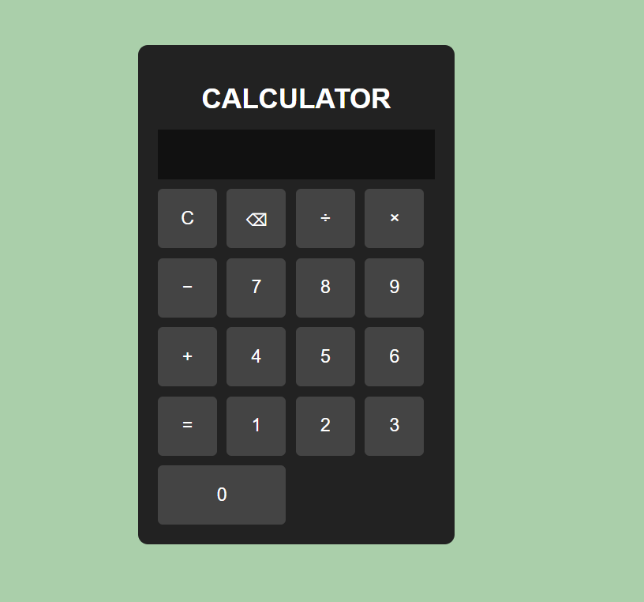
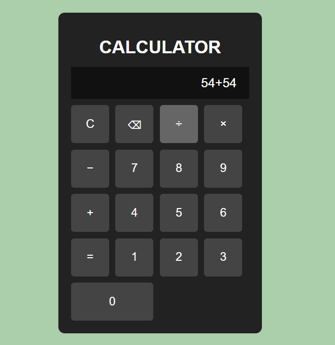
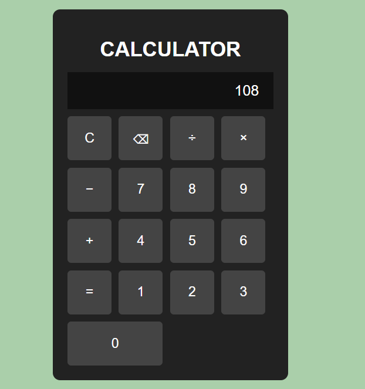

#  Basic Calculator

A simple and responsive calculator built using **HTML, CSS, and JavaScript**.
This project performs basic arithmetic operations like addition, subtraction, multiplication, and division with an interactive user interface.

---

##  Features

* ➕ Addition
* ➖ Subtraction
* ✖️ Multiplication
* ➗ Division
* 🧹 Clear button
* ⌫ Backspace button
* 📱 Responsive design
* 🎨 Stylish dark theme UI
* ⚡ Instant result display

---

##  Technologies Used

* **HTML5** → Structure of the calculator
* **CSS3** → Styling and layout using Grid
* **JavaScript** → Calculator functionality and logic

---

##  Project Structure

```bash
Calculator/
│
├── index.html
├── style.css
└── script.js
```

---

##  Screenshot








##  How It Works

* Users click buttons to enter numbers and operators.
* JavaScript functions handle input and calculations.
* The result is displayed instantly on the screen.
* Backspace removes the last entered character.
* Clear button resets the display.

---

##  Installation & Usage

1. Clone the repository

```bash
git clone https://github.com/your-username/calculator-project.git
```

2. Open the project folder

```bash
cd calculator-project
```

3. Run the project

Open `index.html` in your browser.

---

## 💡 Future Improvements

* Add decimal support
* Add keyboard input support
* Add scientific calculator functions
* Add calculation history
* Improve animations and UI

---

##  Author

**Faheem Ali Mirza**

---

##  License

This project is open-source and free to use.
